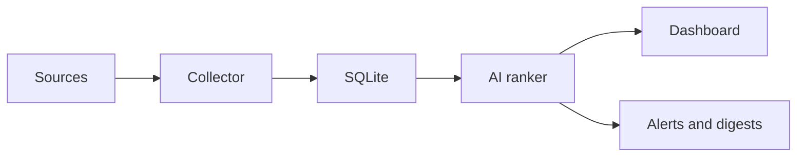

<p align="center">
  
</p>

<p align="center">
  A self-hosted AI briefing system for people who follow more sources than they have time to read.
</p>

<div align="center">

[Product tour](#product-tour) |
[How it works](#how-it-works) |
[Quick start](#quick-start) |
[Deployment](#deployment)

</div>

<table>
  <tr>
    <td><strong>6 source families</strong><br><sub>News, communities, and institutions</sub></td>
    <td><strong>Self-hosted</strong><br><sub>Your data and schedule</sub></td>
    <td><strong>SQLite</strong><br><sub>Simple operations</sub></td>
    <td><strong>MIT</strong><br><sub>Open source</sub></td>
  </tr>
</table>

Beehive collects updates from the sources you care about, ranks each item against a channel-specific interest profile, and delivers concise summaries through a personal dashboard and email.

## Product tour

### See what matters first

Each channel ranks new items against your interests, then reduces them to concise summaries.


> The previews use an English documentation overlay. The current dashboard chrome and email templates are Chinese-first; interface localization is not configurable yet.

### Control every signal

Choose sources, cadence, summary language, and the email destination for each channel.


## How it works



Every source adapter returns a common `RawItem` model. The collector deduplicates items in SQLite, ranks new content against the channel profile, and stores the generated summary and rationale. The web application and scheduled email jobs read from the same database.

## Supported sources

| Source | Integration |
| --- | --- |
| Reddit | Public subreddit Atom feeds |
| Google News | Search-query RSS feeds |
| Hacker News | Official Firebase API |
| Reserve Bank of New Zealand | Official RSS |
| New Zealand Government | Official RSS |
| Federal Reserve | Official RSS |

## Quick start

Requirements:

- Python 3.12
- A GitHub Copilot token for AI ranking
- Azure Communication Services only if email delivery is enabled

```bash
python3.12 -m venv .venv
.venv/bin/python -m pip install -e ".[dev,ai,email]"
.venv/bin/python -m pytest

export DB_PATH="$PWD/beehive.db"
export SESSION_SECRET="$(
  .venv/bin/python -c 'import secrets; print(secrets.token_hex(32))'
)"
.venv/bin/python -m scripts.set_admin_password --db-path "$DB_PATH"
.venv/bin/python -m scripts.run_web
```

Open `http://127.0.0.1:8000/`.

## Configuration

| Variable | Required | Purpose |
| --- | --- | --- |
| `DB_PATH` | No | SQLite path. Defaults to `/data/beehive.db`. |
| `SESSION_SECRET` | Yes for admin access | Signs the owner session cookie. |
| `COPILOT_GITHUB_TOKEN` | Yes for AI processing | Authenticates the GitHub Copilot SDK. |
| `ACS_CONNECTION_STRING` | Only for email | Connects to Azure Communication Services Email. |
| `DIGEST_EMAIL_TO` | Only for email | Default recipient; channels can override it. |
| `DIGEST_EMAIL_FROM` | Only for email | Verified sender address. |

Do not store credentials in the repository. The included Quadlet examples inject them through Podman secrets.

## Collect and digest

```bash
export COPILOT_GITHUB_TOKEN="..."
.venv/bin/python -m scripts.run_collector --mode fetch --db-path "$DB_PATH"

export ACS_CONNECTION_STRING="..."
export DIGEST_EMAIL_TO="you@example.com"
export DIGEST_EMAIL_FROM="beehive@example.com"
.venv/bin/python -m scripts.run_collector --mode digest --db-path "$DB_PATH"
```

The admin interface can create channels, attach sources, configure fetch intervals and email routing, and trigger an immediate collection cycle.

## Deployment

`deploy/` contains rootless Podman Quadlet units for the web application, scheduled collection, manual collection, and daily digest. See [`deploy/README.md`](deploy/README.md).

## Privacy and indexing

Beehive is designed for a personal dashboard. It sends `X-Robots-Tag: noindex, nofollow` and matching HTML metadata by default. Authentication protects administration and write actions, but deployment-level access control is still recommended if the read surface contains private interests or summaries.

Before publishing a deployment, review the generated content, channel names, source configuration, and reverse-proxy policy.

## Project status

`0.1.0` is an alpha release used in production by its maintainer. Database migrations and upgrade compatibility are not yet guaranteed.

[Architecture decisions](docs/adr/) |
[Changelog](CHANGELOG.md) |
[Contributing](CONTRIBUTING.md) |
[Security](SECURITY.md) |
[MIT license](LICENSE)
