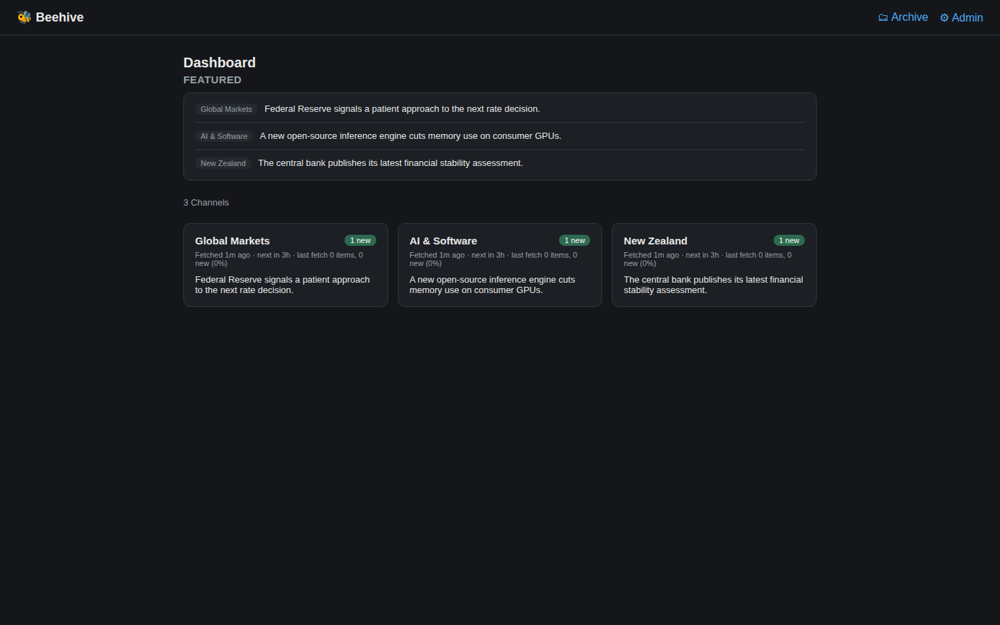

# Beehive

Beehive is a self-hosted, single-user AI news aggregator. It collects posts from multiple sources, ranks them against per-channel interests, produces concise summaries, and sends configurable email digests.



> The preview uses an English documentation overlay. The current dashboard chrome and email templates are Chinese-first; interface localization is not configurable yet.

## Why Beehive

Information overload creates two conflicting problems: reading everything takes too long, while ignoring feeds creates fear of missing important updates. Beehive moves collection, filtering, summarization, and recurring delivery onto infrastructure you control.

## Supported sources

| Source | Integration |
| --- | --- |
| Reddit | Public subreddit Atom feeds |
| Google News | Search-query RSS feeds |
| Hacker News | Official Firebase API |
| Reserve Bank of New Zealand | Official RSS |
| New Zealand Government | Official RSS |
| Federal Reserve | Official RSS |

## Features

- Per-channel interests, fetch intervals, and email recipients
- AI ranking, concise summaries, and optional comment summaries
- Read/unread state and owner-only feedback controls
- Scheduled and manual collection
- Daily email digests
- SQLite storage and rootless Podman deployment

## Architecture

```text
Sources -> Collector -> SQLite -> AI ranker -> Dashboard
                                      |
                                      +----------> Email alerts and digests
```

Each source adapter returns a common `RawItem` model. The collector deduplicates items in SQLite, ranks new content against the channel profile, and stores the generated summary and rationale. The FastAPI application and scheduled email jobs read from the same database.

## Quick start

Requirements:

- Python 3.12
- A GitHub Copilot token for AI ranking
- Azure Communication Services only if email delivery is enabled

```bash
python3.12 -m venv .venv
.venv/bin/python -m pip install -e ".[dev,ai,email]"
.venv/bin/python -m pytest

export DB_PATH="$PWD/beehive.db"
export SESSION_SECRET="$(
  .venv/bin/python -c 'import secrets; print(secrets.token_hex(32))'
)"
.venv/bin/python -m scripts.set_admin_password --db-path "$DB_PATH"
.venv/bin/python -m scripts.run_web
```

Open `http://127.0.0.1:8000/`.

## Configuration

| Variable | Required | Purpose |
| --- | --- | --- |
| `DB_PATH` | No | SQLite path. Defaults to `/data/beehive.db`. |
| `SESSION_SECRET` | Yes for admin access | Signs the owner session cookie. |
| `COPILOT_GITHUB_TOKEN` | Yes for AI processing | Authenticates the GitHub Copilot SDK. |
| `ACS_CONNECTION_STRING` | Only for email | Connects to Azure Communication Services Email. |
| `DIGEST_EMAIL_TO` | Only for email | Default recipient; channels can override it. |
| `DIGEST_EMAIL_FROM` | Only for email | Verified sender address. |

Do not store credentials in the repository. The included Quadlet examples inject them through Podman secrets.

## Collect and digest

```bash
export COPILOT_GITHUB_TOKEN="..."
.venv/bin/python -m scripts.run_collector --mode fetch --db-path "$DB_PATH"

export ACS_CONNECTION_STRING="..."
export DIGEST_EMAIL_TO="you@example.com"
export DIGEST_EMAIL_FROM="beehive@example.com"
.venv/bin/python -m scripts.run_collector --mode digest --db-path "$DB_PATH"
```

The admin interface can create channels, attach sources, configure fetch intervals and email routing, and trigger an immediate collection cycle.

## Deployment

`deploy/` contains rootless Podman Quadlet units for the web application, scheduled collection, manual collection, and daily digest. See [`deploy/README.md`](deploy/README.md).

## Privacy and indexing

Beehive is designed for a personal dashboard. It sends `X-Robots-Tag: noindex, nofollow` and matching HTML metadata by default. Authentication protects administration and write actions, but deployment-level access control is still recommended if the read surface contains private interests or summaries.

Before publishing a deployment, review the generated content, channel names, source configuration, and reverse-proxy policy.

## Status

`0.1.0` is an alpha release used in production by its maintainer. Database migrations and upgrade compatibility are not yet guaranteed.

## License

[MIT](LICENSE)
