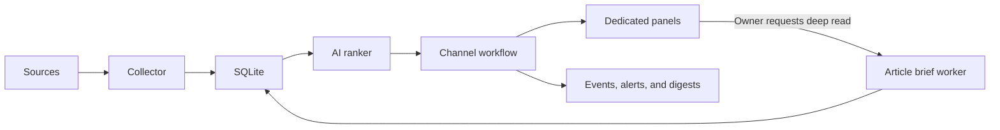

<p align="center">
  
</p>

<p align="center">
  A self-hosted AI briefing system for people who follow more sources than they have time to read.
</p>

<div align="center">

[Product tour](#product-tour) |
[How it works](#how-it-works) |
[Research Sessions](#research-sessions) |
[Quick start](#quick-start) |
[Deployment](#deployment)

</div>

<table>
  <tr>
    <td><strong>9 source families</strong><br><sub>News, communities, stores, and auctions</sub></td>
    <td><strong>Self-hosted</strong><br><sub>Your data and schedule</sub></td>
    <td><strong>SQLite</strong><br><sub>Simple operations</sub></td>
    <td><strong>MIT</strong><br><sub>Open source</sub></td>
  </tr>
</table>

Beehive collects updates from the sources you care about, ranks each item against a channel-specific interest profile, and delivers conclusion-first summaries through a personal dashboard and email. When a headline needs more context, the owner can queue a structured AI brief of the full article.

## Product tour

### See what matters first

Each channel ranks new items against your interests, then states the most useful supported conclusion in one sentence instead of merely describing the topic. The home dashboard ranks content published during a configurable Auckland calendar-day window, defaults to three days, falls back to fetch time when publication time is unavailable, and separates all, unread, and read signals.


> The previews use the default English interface. The global language setting also supports Simplified Chinese, Japanese, Korean, Spanish, French, and German.

### Read the evidence without leaving Beehive

The owner can request an asynchronous AI deep read for any ranked item. Beehive safely fetches and extracts the stored article URL, then produces a cached 500–800 word brief with a bottom line, key findings, important figures, why it matters, and limitations. Partial or paywalled source material is labeled rather than presented as complete.

### Control every signal

Choose sources, cadence, the number of highlights, the minimum visible AI score, the global interface and AI output language, the LLM model used for future AI work, and the email destination for each channel.


### Use the right workflow for each Channel

The Channel workflow is selected at creation and remains immutable:

| Workflow | Purpose | Panel behavior |
| --- | --- | --- |
| Editorial | Recurring news and information | Ranked reading queue with unread state, votes, Deep Read, Home, Archive, and regular email delivery |
| Monitor | Mutable shopping catalogues | Image-led active inventory, price and availability changes, search and filters, plus permanent unavailable history |
| Tracker | Time- or condition-bound listings | Watched, ending-soon, upcoming, and permanent-history sections with item-level follow-up reminders |

Each connector explicitly declares which workflows it supports. The admin Source picker only shows
compatible connectors, and persistence and collection reject incompatible combinations rather than
silently treating every Channel the same.

## How it works



Every source adapter returns a common `RawItem` model. The Channel definition then selects ranking,
persistence, lifecycle, event, and presentation behavior. Editorial content uses read state; Monitor
and Tracker listings refresh stable rows and retain inactive history. Email Groups may combine
Channel workflows, while manually watched Tracker items use separate time-sensitive reminders.
Article briefs use a queued worker, so fetching and AI synthesis never block the web request.

## Supported sources

| Source | Integration | Channel workflow |
| --- | --- | --- |
| Reddit | Public subreddit Atom feeds | Editorial |
| Google News | Search-query RSS feeds | Editorial |
| Hacker News | Official Firebase API | Editorial |
| Reserve Bank of New Zealand | Official RSS | Editorial |
| New Zealand Government | Official RSS | Editorial |
| Federal Reserve | Official RSS | Editorial |
| Shopify storefronts | Public collection JSON | Monitor |
| Land & Sea | Public server-rendered listing data | Monitor |
| All About Auctions | Public upcoming-auction and paginated lot data, including bids and RRP | Tracker |

## Research Sessions

Beside the recurring Channel model above, the Owner can open a Research Session for a one-time
question that does not belong to any Channel. Every Research Session route, including read-only
views, requires an authenticated Owner session (ADR-0008); there is no publicly reachable
Research page.

- **Research-approved connector coverage.** A Research Plan draws only from the credentialless
  editorial connectors approved for Research: Reddit subreddit feeds, Google News search queries,
  Hacker News stories and search, and the three fixed official RSS feeds (Reserve Bank of New
  Zealand, New Zealand Government, Federal Reserve). Recurring retail and auction monitors remain
  Channel-only sources (ADR-0007).
- **Visible plan.** The AI proposes, and can later revise, a Research Plan listing the
  source-specific queries it intends to run. The application validates every proposed connector
  and configuration before anything executes, and the plan itself is shown to the Owner rather
  than hidden.
- **Durable, asynchronous evidence collection.** A Research Run collects, enriches, and clusters
  evidence in the background across a fixed 20-minute budget per run, and survives worker
  restarts or cancellation: completed steps are persisted before a snapshot is sealed (ADR-0009,
  ADR-0010).
- **Conclusion-first synthesis.** A Research Synthesis states a citation-backed answer to the
  question instead of only listing sources, and is versioned as the Owner refreshes evidence or
  revises the plan.
- **Stable external citations.** Each Evidence Item is assigned one citation number the first
  time it is collected; that number is never reassigned, so a synthesis or chat citation always
  points at the same item.
- **Evidence curation.** The Owner can exclude an Evidence Item from future synthesis and chat,
  or restore it later, without deleting the underlying evidence.
- **Durable long chat.** Conversation about a Research Session continues past the length of a
  single AI context window using an AI-maintained, versioned Conversation Memory that a later
  chat reply can pin.

### Limitations and trust

- **Existing provider coverage, not arbitrary web history.** A Research Plan can only add one of
  the seven connector types above; it cannot browse an arbitrary URL or search the open web
  outside these providers.
- **The AI never executes connectors or tools.** The AI proposes plan sources and drafts
  synthesis text; the application performs every connector call. Any AI call that reads
  externally sourced evidence text runs with zero available tools, so an instruction hidden
  inside fetched content has nothing to invoke.
- **Model knowledge is labeled separately.** A Research Synthesis may include a clearly
  separated, clearly labeled section of general model knowledge that supplements, but is never
  mixed into, the citation-backed answer built from collected evidence.
- **Full extracted text is stored locally.** Up to 30 Evidence Items per Research Run are deep
  fetched, and their full extracted text is stored in the local SQLite database, not only a
  snippet, until the session is hard-deleted; the remaining items keep only the connector's
  snippet.
- **Archiving keeps data; deleting removes it.** Archiving a Research Session preserves its
  question, evidence, and conversation for later reference and blocks new runs or messages
  against it until it is unarchived. Hard-deleting a session cascades the delete relationally
  across every research table (sources, runs, plan revisions, evidence, snapshots, curation,
  clusters, syntheses, messages, chat requests, and conversation memory) in one transaction. This
  is not a forensic erasure: it does not securely overwrite freed SQLite pages or any prior copy
  retained in the write-ahead log, which may remain recoverable on disk until the database file
  is vacuumed or otherwise reclaimed.
- **No public indexing or private routes.** Research Sessions are covered by the same
  application-wide `X-Robots-Tag: noindex, nofollow` header described in
  [Privacy and indexing](#privacy-and-indexing), and every route additionally requires an
  authenticated Owner session, unlike the public Dashboard and Channel pages.

See [ADR-0006](docs/adr/0006-separate-research-data-model.md) through
[ADR-0010](docs/adr/0010-durably-stage-research-evidence.md) for the design decisions, and
`src/beehive/research/` for the plan, collect, enrich, cluster, and assess pipeline a Research Run
drives end to end. Operating the always-on Research worker and its reconcile timer is covered in
[`deploy/README.md`](deploy/README.md#research-worker-adr-0009).

## Quick start

Requirements:

- Python 3.12
- A GitHub Copilot token for AI ranking and article briefs
- Azure Communication Services only if email delivery is enabled

```bash
python3.12 -m venv .venv
.venv/bin/python -m pip install -e ".[dev,ai,email]"
.venv/bin/python -m pytest

export DB_PATH="$PWD/beehive.db"
export SESSION_SECRET="$(
  .venv/bin/python -c 'import secrets; print(secrets.token_hex(32))'
)"
.venv/bin/python -m scripts.set_admin_password --db-path "$DB_PATH"
.venv/bin/python -m scripts.run_web
```

Open `http://127.0.0.1:8000/`.

## Configuration

| Variable | Required | Purpose |
| --- | --- | --- |
| `DB_PATH` | No | SQLite path. Defaults to `/data/beehive.db`. |
| `SESSION_SECRET` | Yes for admin access | Signs the owner session cookie. |
| `COPILOT_GITHUB_TOKEN` | Yes for AI processing | Authenticates ranking, summary migration, article-brief, and Research worker AI calls. It is not required by the web process. |
| `ACS_CONNECTION_STRING` | Only for email | Connects to Azure Communication Services Email. |
| `DIGEST_EMAIL_TO` | Only for email | Default recipient; channels can override it. |
| `DIGEST_EMAIL_FROM` | Only for email | Verified sender address. |

Do not store credentials in the repository. The included Quadlet examples inject them through Podman secrets.

The admin settings page stores one global platform language in SQLite. English is the default;
the selected language applies to the web interface, email copy, alerts, AI summaries, rationales,
comment summaries, and article briefs. Existing generated content is not translated automatically.

The same page also stores one global LLM model. `claude-haiku-4.5` preserves the default behavior;
changing it applies to future rankings, comment summaries, summary rewrites, and article briefs.
Previously generated content is not regenerated automatically.

## Collect and digest

```bash
export COPILOT_GITHUB_TOKEN="..."
.venv/bin/python -m scripts.run_collector --mode fetch --db-path "$DB_PATH"

export ACS_CONNECTION_STRING="..."
export DIGEST_EMAIL_TO="you@example.com"
export DIGEST_EMAIL_FROM="beehive@example.com"
.venv/bin/python -m scripts.run_collector --mode digest --db-path "$DB_PATH"

.venv/bin/python -m scripts.run_collector --mode auction-reminders --db-path "$DB_PATH"
```

The `auction-reminders` mode name is retained for deployment compatibility, but it runs the generic
Tracker reminder worker. The current auction adapter sends one reminder about an hour before the
latest known closing time and handles genuine auction extensions.

The admin interface creates an immutable Channel workflow, offers only compatible Sources,
configures collection and email delivery, and can trigger an immediate collection cycle. The Owner
can add watchable Tracker items to a private Watch List.

An owner deep-read request is stored durably in SQLite. In the Quadlet deployment, a path unit starts
the bounded article worker immediately and a timer reconciles any missed wakeup.

A Research Run or chat reply is likewise stored durably in SQLite and only progresses once the
Research worker is running. For local development, only `DB_PATH` and `COPILOT_GITHUB_TOKEN` are
needed; every other knob has a default:

```bash
export COPILOT_GITHUB_TOKEN="..."
.venv/bin/python -m scripts.run_research_worker --db-path "$DB_PATH"
```

Deployment, the pool-size and lease `RESEARCH_WORKER_*` environment overrides, the DB-enforced
global caps, the reconcile timer, and rollout/rollback are covered in
[`deploy/README.md`](deploy/README.md#research-worker-adr-0009).

### Rewrite existing unread summaries

After upgrading from topic-description summaries, existing ranked and unread items can be rewritten
to the conclusion-first format. Snapshot the item high-water mark before deployment and keep it
constant for every command in the run:

```bash
HIGH_WATER_ITEM_ID="$(
  .venv/bin/python -c \
    'import os, sqlite3; c=sqlite3.connect(os.environ["DB_PATH"]); print(c.execute("SELECT COALESCE(MAX(id), 0) FROM items").fetchone()[0])'
)"
RUN_ID="conclusion-first-v1"

.venv/bin/python -m scripts.run_collector \
  --mode rewrite-unread-summaries --db-path "$DB_PATH" \
  --high-water-item-id "$HIGH_WATER_ITEM_ID" --run-id "$RUN_ID" --dry-run

.venv/bin/python -m scripts.run_collector \
  --mode rewrite-unread-summaries --db-path "$DB_PATH" \
  --high-water-item-id "$HIGH_WATER_ITEM_ID" --run-id "$RUN_ID" \
  --canary-limit 10 --confirm-rewrite

.venv/bin/python -m scripts.run_collector \
  --mode rewrite-unread-summaries --db-path "$DB_PATH" \
  --high-water-item-id "$HIGH_WATER_ITEM_ID" --run-id "$RUN_ID" --confirm-rewrite
```

The run is resumable and only updates items that are still unread. It prints progress as JSON and
exits nonzero if any item fails, so rerunning the same command safely retries remaining candidates.
To restore summaries changed by that run:

```bash
.venv/bin/python -m scripts.run_collector \
  --mode rollback-unread-summaries --db-path "$DB_PATH" \
  --run-id "$RUN_ID" --confirm-rollback
```

Rollback only restores a summary when that run's replacement is still live. If a later run or
manual edit changed it, the rollback exits nonzero and retains the log entry so it can be retried
after the later change is removed.

## Deployment

`deploy/` contains rootless Podman Quadlet units for the web application, scheduled and manual
collection, email digests, five-minute Tracker reminder checks, the queued article-brief worker,
and the always-on Research worker with its reconcile timer. See
[`deploy/README.md`](deploy/README.md).

## Privacy and indexing

Beehive is designed for a personal dashboard. It sends `X-Robots-Tag: noindex, nofollow` and matching HTML metadata by default. Authentication protects administration and write actions, but deployment-level access control is still recommended if the read surface contains private interests or summaries.

Every Research Session route additionally requires an authenticated Owner session, including
read-only views, so there is no public or unauthenticated route to a Research Session at all.

Before publishing a deployment, review the generated content, channel names, source configuration, and reverse-proxy policy.

## Project status

`0.1.0` is an alpha release used in production by its maintainer. Database migrations and upgrade compatibility are not yet guaranteed.

[Architecture decisions](docs/adr/) |
[Changelog](CHANGELOG.md) |
[Contributing](CONTRIBUTING.md) |
[Security](SECURITY.md) |
[MIT license](LICENSE)
