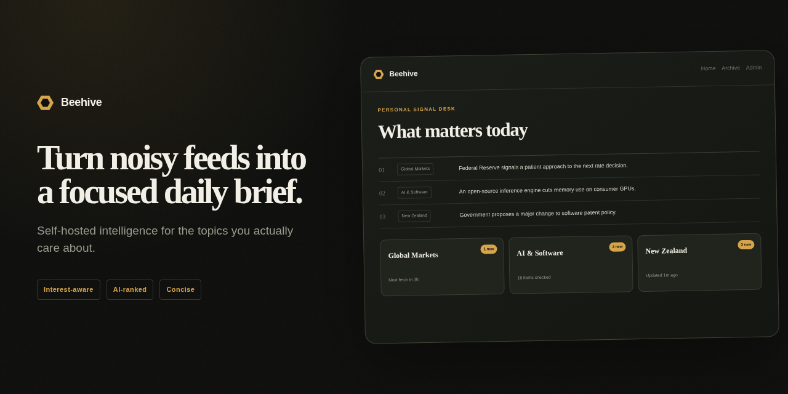
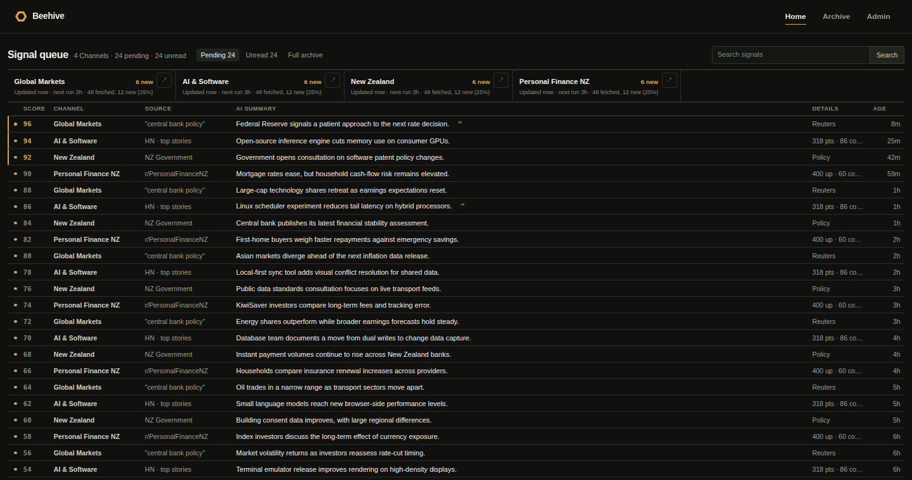
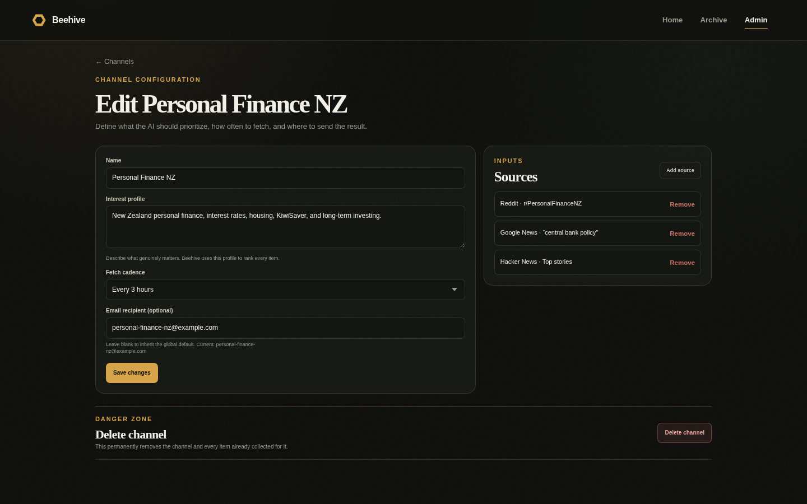
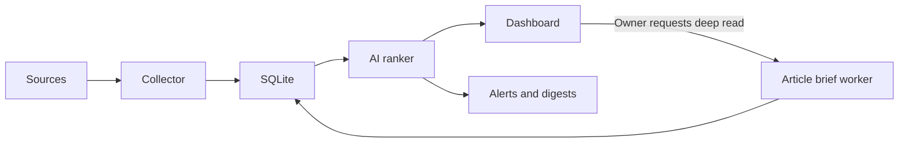

<p align="center">
  
</p>

<p align="center">
  A self-hosted AI briefing system for people who follow more sources than they have time to read.
</p>

<div align="center">

[Product tour](#product-tour) |
[How it works](#how-it-works) |
[Quick start](#quick-start) |
[Deployment](#deployment)

</div>

<table>
  <tr>
    <td><strong>6 source families</strong><br><sub>News, communities, and institutions</sub></td>
    <td><strong>Self-hosted</strong><br><sub>Your data and schedule</sub></td>
    <td><strong>SQLite</strong><br><sub>Simple operations</sub></td>
    <td><strong>MIT</strong><br><sub>Open source</sub></td>
  </tr>
</table>

Beehive collects updates from the sources you care about, ranks each item against a channel-specific interest profile, and delivers conclusion-first summaries through a personal dashboard and email. When a headline needs more context, the owner can queue a structured AI brief of the full article.

## Product tour

### See what matters first

Each channel ranks new items against your interests, then states the most useful supported conclusion in one sentence instead of merely describing the topic.



> The previews use the default English interface. The global language setting also supports Simplified Chinese, Japanese, Korean, Spanish, French, and German.

### Read the evidence without leaving Beehive

The owner can request an asynchronous AI deep read for any ranked item. Beehive safely fetches and extracts the stored article URL, then produces a cached 500–800 word brief with a bottom line, key findings, important figures, why it matters, and limitations. Partial or paywalled source material is labeled rather than presented as complete.

### Control every signal

Choose sources, cadence, the global interface and AI output language, and the email destination for each channel.



## How it works



Every source adapter returns a common `RawItem` model. The collector deduplicates items in SQLite, ranks new content against the channel profile, and stores the generated summary and rationale. The web application and scheduled email jobs read from the same database. Article briefs use a separate queued worker, so fetching and AI synthesis never block the web request.

## Supported sources

| Source | Integration |
| --- | --- |
| Reddit | Public subreddit Atom feeds |
| Google News | Search-query RSS feeds |
| Hacker News | Official Firebase API |
| Reserve Bank of New Zealand | Official RSS |
| New Zealand Government | Official RSS |
| Federal Reserve | Official RSS |

## Quick start

Requirements:

- Python 3.12
- A GitHub Copilot token for AI ranking and article briefs
- Azure Communication Services only if email delivery is enabled

```bash
python3.12 -m venv .venv
.venv/bin/python -m pip install -e ".[dev,ai,email]"
.venv/bin/python -m pytest

export DB_PATH="$PWD/beehive.db"
export SESSION_SECRET="$(
  .venv/bin/python -c 'import secrets; print(secrets.token_hex(32))'
)"
.venv/bin/python -m scripts.set_admin_password --db-path "$DB_PATH"
.venv/bin/python -m scripts.run_web
```

Open `http://127.0.0.1:8000/`.

## Configuration

| Variable | Required | Purpose |
| --- | --- | --- |
| `DB_PATH` | No | SQLite path. Defaults to `/data/beehive.db`. |
| `SESSION_SECRET` | Yes for admin access | Signs the owner session cookie. |
| `COPILOT_GITHUB_TOKEN` | Yes for AI processing | Authenticates ranking, summary migration, and article-brief workers. It is not required by the web process. |
| `ACS_CONNECTION_STRING` | Only for email | Connects to Azure Communication Services Email. |
| `DIGEST_EMAIL_TO` | Only for email | Default recipient; channels can override it. |
| `DIGEST_EMAIL_FROM` | Only for email | Verified sender address. |

Do not store credentials in the repository. The included Quadlet examples inject them through Podman secrets.

The admin settings page stores one global platform language in SQLite. English is the default;
the selected language applies to the web interface, email copy, alerts, AI summaries, rationales,
comment summaries, and article briefs. Existing generated content is not translated automatically.

## Collect and digest

```bash
export COPILOT_GITHUB_TOKEN="..."
.venv/bin/python -m scripts.run_collector --mode fetch --db-path "$DB_PATH"

export ACS_CONNECTION_STRING="..."
export DIGEST_EMAIL_TO="you@example.com"
export DIGEST_EMAIL_FROM="beehive@example.com"
.venv/bin/python -m scripts.run_collector --mode digest --db-path "$DB_PATH"
```

The admin interface can create channels, attach sources, configure fetch intervals and email routing, and trigger an immediate collection cycle.

An owner deep-read request is stored durably in SQLite. In the Quadlet deployment, a path unit starts
the bounded article worker immediately and a timer reconciles any missed wakeup.

### Rewrite existing unread summaries

After upgrading from topic-description summaries, existing ranked and unread items can be rewritten
to the conclusion-first format. Snapshot the item high-water mark before deployment and keep it
constant for every command in the run:

```bash
HIGH_WATER_ITEM_ID="$(
  .venv/bin/python -c \
    'import os, sqlite3; c=sqlite3.connect(os.environ["DB_PATH"]); print(c.execute("SELECT COALESCE(MAX(id), 0) FROM items").fetchone()[0])'
)"
RUN_ID="conclusion-first-v1"

.venv/bin/python -m scripts.run_collector \
  --mode rewrite-unread-summaries --db-path "$DB_PATH" \
  --high-water-item-id "$HIGH_WATER_ITEM_ID" --run-id "$RUN_ID" --dry-run

.venv/bin/python -m scripts.run_collector \
  --mode rewrite-unread-summaries --db-path "$DB_PATH" \
  --high-water-item-id "$HIGH_WATER_ITEM_ID" --run-id "$RUN_ID" \
  --canary-limit 10 --confirm-rewrite

.venv/bin/python -m scripts.run_collector \
  --mode rewrite-unread-summaries --db-path "$DB_PATH" \
  --high-water-item-id "$HIGH_WATER_ITEM_ID" --run-id "$RUN_ID" --confirm-rewrite
```

The run is resumable and only updates items that are still unread. It prints progress as JSON and
exits nonzero if any item fails, so rerunning the same command safely retries remaining candidates.
To restore summaries changed by that run:

```bash
.venv/bin/python -m scripts.run_collector \
  --mode rollback-unread-summaries --db-path "$DB_PATH" \
  --run-id "$RUN_ID" --confirm-rollback
```

Rollback only restores a summary when that run's replacement is still live. If a later run or
manual edit changed it, the rollback exits nonzero and retains the log entry so it can be retried
after the later change is removed.

## Deployment

`deploy/` contains rootless Podman Quadlet units for the web application, scheduled and manual collection, daily digest, and the queued article-brief worker. See [`deploy/README.md`](deploy/README.md).

## Privacy and indexing

Beehive is designed for a personal dashboard. It sends `X-Robots-Tag: noindex, nofollow` and matching HTML metadata by default. Authentication protects administration and write actions, but deployment-level access control is still recommended if the read surface contains private interests or summaries.

Before publishing a deployment, review the generated content, channel names, source configuration, and reverse-proxy policy.

## Project status

`0.1.0` is an alpha release used in production by its maintainer. Database migrations and upgrade compatibility are not yet guaranteed.

[Architecture decisions](docs/adr/) |
[Changelog](CHANGELOG.md) |
[Contributing](CONTRIBUTING.md) |
[Security](SECURITY.md) |
[MIT license](LICENSE)
