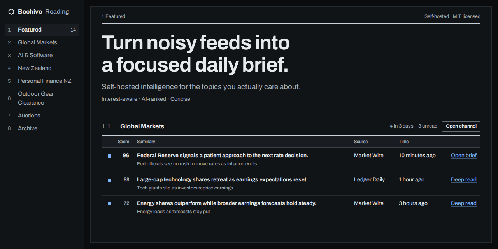
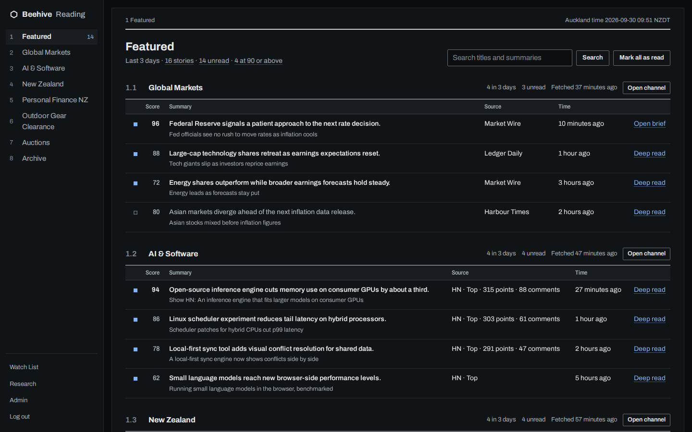
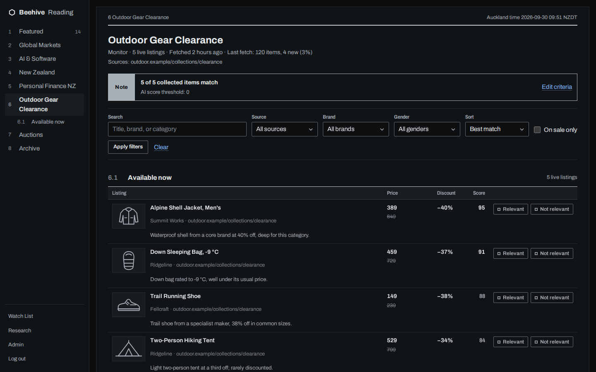

# Beehive

<p align="center">
  
</p>

Beehive is a self-hosted app for people who follow more news, online stores and auctions than they
have time to read. Tell it what you care about, and its AI picks the stories, sales and auction lots
that match, with a one-line summary of each.

You read them on one page or in email digests on your schedule. Beehive runs on your own computer
or server, for one person, and uses your GitHub Copilot account for the AI.

[What it does](#what-beehive-does) · [Quick start](#quick-start) · [Run it on a server](#run-it-on-a-server) · [Documentation](#documentation)

## What Beehive does

- **Follow the news you care about.** Pull in stories from any site's RSS or Atom feed, Reddit,
  Google News searches, Hacker News and the official feeds of the Reserve Bank of New Zealand, the
  NZ Government and the US Federal Reserve.
- **See the best first.** The AI scores each new story from 0 to 100 against what you told it and
  sums it up in one line. The home page shows each channel's top stories.
- **Catch sales and restocks.** A store monitor watches Shopify stores, Land & Sea, THE OUTNET,
  Mytheresa, END. and YOOX for new items, price drops and restocks.
- **Never miss an auction.** An auction tracker follows lots on All About Auctions. Watch a lot and
  Beehive emails you about an hour before it closes.
- **Read long articles in brief.** Ask for a **Deep read** and get the bottom line, key findings
  and figures of the full article.
- **Get email digests on your schedule.** Put channels into email groups, each with its own
  schedule.
- **Research a one-off question.** A research session gathers evidence from the news sources and
  writes an answer with numbered sources.
- **Use your language.** Pages, emails and summaries in English, Simplified Chinese, Japanese,
  Korean, Spanish, French or German.





The screenshots use made-up data.

## Quick start

You need:
- Python 3.12 and git. Beehive is tested on Linux.
- A GitHub account with Copilot, and a
  [fine-grained personal access token](https://github.com/settings/personal-access-tokens/new)
  with the **Copilot Requests** permission. The AI runs on it.
- Optional: Azure Communication Services, to send email. Without it, Beehive prints each email
  instead.

1. Get the code and install it:

   ```bash
   git clone https://github.com/sinmentis/beehive.git && cd beehive
   python3.12 -m venv .venv
   .venv/bin/pip install -e ".[ai]"
   ```

2. Choose where the database goes, create a secret for sign-in cookies, and set your admin
   password:

   ```bash
   export DB_PATH="$PWD/beehive.db" SESSION_SECRET="$(openssl rand -hex 32)"
   .venv/bin/python -m scripts.set_admin_password
   ```

3. Start Beehive:

   ```bash
   .venv/bin/python -m scripts.run_web
   ```

   Beehive is now running at <http://127.0.0.1:8000>. It listens on all network interfaces, so
   other devices on your network can open it too.

4. Open <http://127.0.0.1:8000/admin> and sign in. Select **New channel**, keep the type
   **Editorial**, describe what you care about under **What to focus on**, and select **Create
   channel**. Then select **Add source** and add one, such as Hacker News.

5. In a second terminal, in the `beehive` folder, fetch and score the first stories:

   ```bash
   export DB_PATH="$PWD/beehive.db" COPILOT_GITHUB_TOKEN="github_pat_..."
   .venv/bin/python -m scripts.run_collector --mode fetch
   ```

   Open <http://127.0.0.1:8000/> again. The channel's top stories are there, with their scores
   and one-line summaries.

To keep Beehive current, run the fetch command on a schedule. Deep reads, research, email and
reminders each have their own command; see [Configuration](docs/configuration.md#commands).
Without the token, Beehive still collects stories but can't score or summarize them.

## Run it on a server

[`deploy/`](deploy/README.md) has rootless Podman units that run the web app and every background
job, plus a nightly backup.

> [!IMPORTANT]
> By default anyone who can reach Beehive can read its home, channel, archive and search pages,
> and finished deep reads. The admin, research, the Watch List and every change need your
> password. To keep your reading private too, set **Who can read** in **Global settings** to
> **Only you, after signing in**.

## Documentation

- [User guide](docs/user-guide.md): channels, sources, deep reads, the Watch List, email and research
- [Configuration](docs/configuration.md): every setting, environment variable and command
- [How it works](docs/how-it-works.md): the pipeline, research and privacy
- [Deployment](deploy/README.md): the Podman units, secrets, backups and releases
- [Contributing](CONTRIBUTING.md) · [Changelog](CHANGELOG.md) · [Security](SECURITY.md) · [Design decisions](docs/adr/) · [Glossary](CONTEXT.md)

## Project status

Beehive 0.1.0 is an alpha. Its maintainer uses it every day, but database upgrades between versions
aren't guaranteed yet.

## License

[MIT](LICENSE)
