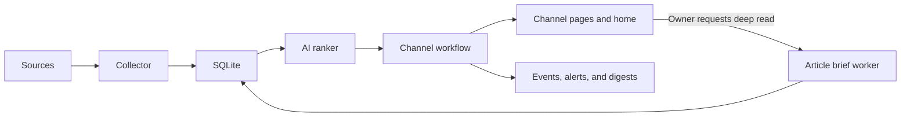

# How it works

What happens between a source and your screen, what Beehive does with the text it fetches, and
why. Read this to change Beehive or to judge it. [CONTEXT.md](../CONTEXT.md) defines the terms, and
[docs/adr/](adr/) records the design decisions.

## The pipeline

Every source adapter (connector) returns the same `RawItem` model, and everything lives in one
SQLite file ([ADR-0004](adr/0004-sqlite-not-duckdb.md)). The channel's type, its workflow, then
decides how items are ranked, stored, followed over time, turned into events and shown. News
(Editorial) items carry a read state. Store (Monitor) and auction (Tracker) listings refresh one
stable row each and keep a history of inactive listings. Email groups can mix channel types, while
watched auction lots get their own time-sensitive reminders.

A fetch failure in one source doesn't stop the others, and an AI failure only skips that channel's
ranking ([ADR-0002](adr/0002-per-source-per-channel-failure-isolation.md)). Unscored items are
retried on the next fetch. When it scores news stories, the AI reads your **Relevant** and **Not
relevant** votes as examples ([ADR-0001](adr/0001-vote-feedback-as-fewshot-prompt-context.md)).

## Channel types

A channel's type is chosen when it is created and never changes. Each connector declares which
types it supports. The admin only offers compatible sources, and storage and collection reject a
mismatch instead of treating every channel the same.

## Deep reads

A deep-read request is stored in SQLite before anything else happens, so the web request never
waits on fetching or the AI. On a server, a path unit starts the bounded worker at once, and a
timer runs it every 30 minutes in case a wakeup was missed. The worker fetches the article safely,
extracts its text and caches the brief. When the source text is partial or paywalled, the brief
says so instead of presenting it as complete. Reddit blocks automated page access, so a Reddit
brief falls back to the stored post text and says what may be missing.

## Research sessions

A research session answers a one-time question outside any channel. Every research route,
including read-only views, needs the owner's sign-in; there is no public research page
([ADR-0008](adr/0008-research-sessions-are-owner-only.md)).

- **Fixed sources.** A plan can only use the credential-free news connectors approved for research:
  Reddit, Google News, Hacker News and the three official feeds. Store and auction monitors stay
  channel-only ([ADR-0007](adr/0007-application-controlled-research-tools.md)). Research can't
  browse an arbitrary URL or search the open web.
- **The AI proposes, the app runs.** The AI proposes and revises the plan and drafts the answer.
  The application validates every proposed search and makes every connector call itself. Any AI
  call that reads fetched text runs with no tools available, so an instruction hidden in fetched
  content has nothing to call.
- **Bounded runs.** Each run is limited to 20 minutes, eight planning rounds, 30 deep fetches and
  25 candidates per source, and can stop sooner when the evidence is enough.
- **Durable work.** Runs and chat replies are queued in SQLite and survive a worker restart or
  cancellation. Finished steps are saved before an evidence snapshot is sealed
  ([ADR-0009](adr/0009-durable-research-worker.md),
  [ADR-0010](adr/0010-durably-stage-research-evidence.md)).
- **Stable citations.** An evidence item gets its citation number the first time it is collected
  and keeps it, so a citation always points at the same item.
- **Model knowledge is labeled.** The answer may add general model knowledge in a separate,
  labeled section, never mixed into the part built from collected evidence.
- **Stored text.** Up to 30 evidence items per run are fetched in full, and their extracted text is
  stored in the local database until the session is deleted. Other items keep only the
  connector's snippet.
- **Archive and delete.** Archiving keeps a session's question, evidence and conversation, and
  blocks new runs and messages until it is unarchived. Deleting removes every research row for the
  session in one transaction. It doesn't securely overwrite freed SQLite pages or earlier copies in
  the write-ahead log, which can stay on disk until the file is vacuumed.
- **Long chats.** A chat can outgrow one AI context window. The AI keeps a versioned summary of the
  conversation, and a reply can refer back to it.

Research keeps its own data model ([ADR-0006](adr/0006-separate-research-data-model.md)). The plan,
collect, enrich, cluster and assess pipeline lives in `src/beehive/research/`, and running the
worker is covered in [deploy/README.md](../deploy/README.md#research-worker-adr-0009).

## Privacy and indexing

Beehive is built for one person. By default its reading pages (home, channel pages, archive,
search and finished deep reads) are public, and only the admin, research, the Watch List and every
change need the owner's password ([ADR-0003](adr/0003-public-read-surfaces-password-only-admin.md),
[ADR-0005](adr/0005-vote-writes-require-owner-session.md)). If your channels reveal private
interests, set **Who can read** to **Only you, after signing in**. Then anyone signed out goes to
the sign-in page first and comes back to the page they asked for
([ADR-0011](adr/0011-optional-private-reading.md)).

Every response sends `X-Robots-Tag: noindex, nofollow`, and every page carries the matching
`robots` meta tag, so search engines leave it out. Link previews still work: reading pages carry
Open Graph and Twitter card tags, and a deep read previews with its bottom line.

Before you publish a deployment, review its generated content, channel names, source settings and
reverse-proxy rules.
