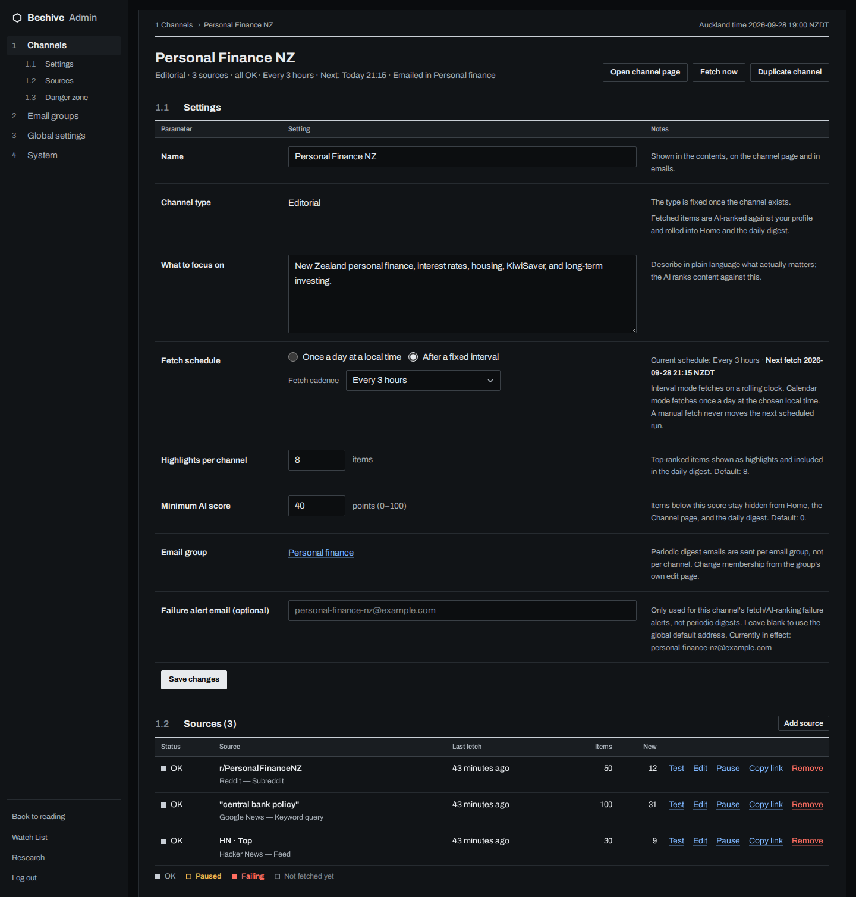
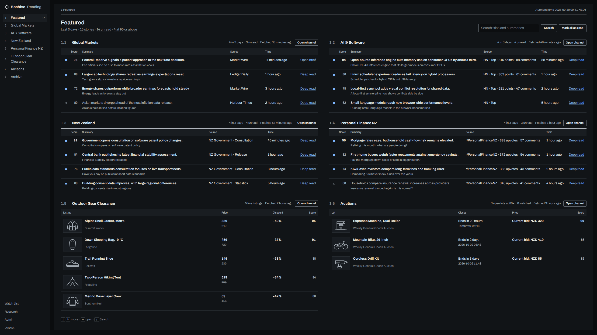
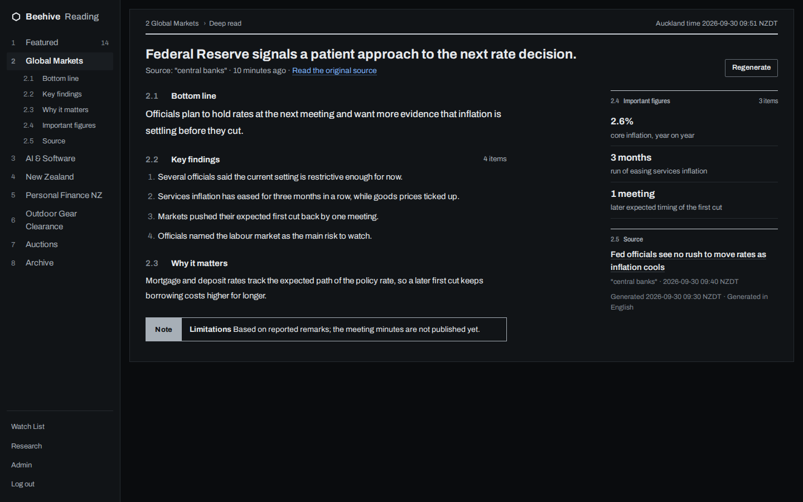

# User guide

How to set up and use Beehive once it is running. To install it, see the
[quick start](../README.md#quick-start). For every setting and command, see
[Configuration](configuration.md).

You do everything in the web app. Sign in at `/admin` to change anything. The screenshots use
made-up data.

## Create a channel

A channel collects items about one topic from the sources you pick, and the AI scores each new item
against what you tell it you care about.

1. In the admin, open **Channels** and select **New channel**.
2. Pick a **Channel type** (see the next section). You can't change it later.
3. Describe what you want under **What to focus on**, in your own words. Say what to skip too, for
   example "Open-source developer tools. Skip funding news."
4. Set the **Fetch schedule**: **After a fixed interval**, such as every 3 hours, or **Once a day at
   a local time**.
5. Optional: set **Highlights per channel**, the number of top stories shown first, and a
   **Minimum AI score** to hide items below it.
6. Select **Create channel**, then **Add source**.

The channel's admin page shows **Finish setting up this Channel** with the steps that are left.

## Choose a channel type

| Type | Use it for | What you get |
| --- | --- | --- |
| **Editorial** | News and discussion | Scored stories with one-line summaries, unread markers, votes and deep reads, on the home page, the channel page, the archive and in email |
| **Monitor** | Online store catalogues | Live listings with photos, prices and discounts; new items, price drops and restocks; search and filters; a history of listings that sold out or were removed |
| **Tracker** | Auctions and other listings with an end time | Lots ending soon and coming up, the lots you watch, and a reminder before a watched lot closes |

## Add sources

Each source works with one channel type, so **Add source** only offers the ones that fit.

| Source | What it reads | Channel type |
| --- | --- | --- |
| Reddit | Posts in a subreddit | Editorial |
| Google News | Results for a search | Editorial |
| Hacker News | Top, best, new, Ask HN or Show HN stories, or a search | Editorial |
| Reserve Bank of New Zealand | Official news | Editorial |
| New Zealand Government | Official news | Editorial |
| US Federal Reserve | Official news | Editorial |
| Shopify stores | A collection, such as a sale page | Monitor |
| Land & Sea | A listing page | Monitor |
| Designer clearance | Sale catalogues from THE OUTNET, Mytheresa, END. and YOOX | Monitor |
| All About Auctions | Upcoming auctions and their lots, with bids and RRP | Tracker |

Select **Test** next to a source to see a sample of what it returns, without saving anything.
**Pause** stops a source without removing it.

## Read your highlights

The home page, **Featured**, gives every channel a section: the top stories of each news channel,
the best live listings of each store monitor, and the good lots still open in each auction
tracker. It shows stories from the last three days. To change that, go to **Global settings** and
set the **Featured window**. The counts at the top open a ranked list of every featured story, which
you can filter to unread, read, or a score of 90 and above.

- A blue square marks a story you haven't read. Select the square to mark it read.
- **Relevant** and **Not relevant** tell the AI what you like. It takes your votes into account
  when it scores new stories.
- Press `j` and `k` to move between stories, `o` to open one and `/` to search.
- The archive keeps every story, day by day. Search covers stories, listings and lots.

On a wide screen, channel sections sit side by side, and long lists flow into columns.

## Get a deep read

Select **Deep read** on a scored story. Beehive fetches the full article and writes a brief of
about 500 to 800 words: the bottom line, key findings, important figures, why it matters, and what
it could not check. When the brief is ready, the link turns into **Open brief**. If the article was
cut short or behind a paywall, the brief says so.

## Watch an auction lot

On a **Tracker** channel, select **Watch** on a lot. It joins your **Watch List**, and Beehive
emails you about an hour before the lot closes. If the auction pushes the closing time back, the
reminder moves with it. The Watch List shows each reminder's state and lets you retry one that
failed.

## Set up email digests

Sending email needs the email settings in [Configuration](configuration.md#environment-variables).
Without them, Beehive prints each email in the terminal instead.

1. Open **Email groups** and select **New email group**.
2. Pick the **Channels in this group**. A group can mix news, store and auction channels.
3. Set the **Delivery schedule**: after a fixed interval, or on selected days at a local time.
4. Select **Preview** to see what the next email would hold, or **Send test email** to get a copy.
   Neither one marks anything as sent.

A group only sends when it has something new. A story that was already emailed isn't sent again,
even when its feed republishes it under a new link. Email goes to the group's own recipient if it
has one, otherwise to the **Default email address** at the top of **Email groups**. A channel's
**Failure alert email** gets that channel's failure alerts.

## Research a question

For a one-off question that doesn't belong in a channel, open **Research** and select **New
Research Session**. Beehive plans searches across Reddit, Google News, Hacker News and the official
feeds, and shows you the plan. It then collects evidence for up to 20 minutes and writes an answer
with numbered sources.

- Edit the searches before the next run. Removed searches keep their evidence.
- Each piece of evidence keeps its number, so a citation always points at the same item.
- Leave a piece of evidence out of the answer, or put it back, without deleting it.
- Ask follow-up questions in a chat that remembers earlier questions, even in long conversations.
- Beehive emails you when a run finishes, if email is set up.
- Archive a session to stop new runs and messages until you unarchive it. Delete it to remove it
  and everything it collected.

Research only uses those news sources: it can't browse any website you name. Only you can see
research sessions, after you sign in. [How it works](how-it-works.md#research-sessions) explains its
limits and how it handles fetched text.

## Undo a change

When you delete a channel, a source or an email group, or clear a channel's data, Beehive keeps a
copy for seven days. To bring it back, open **System**, find it under **Activity** and select
**Undo**.

## Check that everything works

The **System** page shows whether fetching, email, reminders and research are working, and lists
recent failures. Each channel shows when it last fetched and what went wrong. A source that fails
waits an hour before it tries again, and twice as long after each further failure, up to a day.
